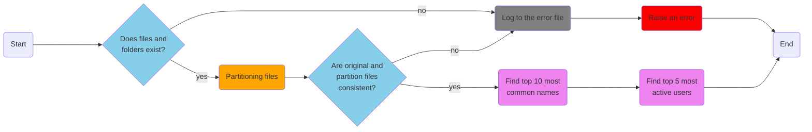

# Social Network

This program operates on a social network's data comprised of 4 CSV files, each containing specific tables:

- **Friends table**: Contains information about friendships.
- **Posts table**: Contains information about users' posting activities.
- **Reactions table**: Contains information about user reactions.
- **Users table**: Contains personal data about users.

The program performs several tasks:
- Checks the existence of data files.
- Partitions reactions and posts files based on post or reaction type.
- Verifies data consistency between original and partitioned files.
- Analyzes data and:
  - Prints a list of the top 10 most common names on the social network.
  - Prints a list of the top 5 most active users on the social network.

