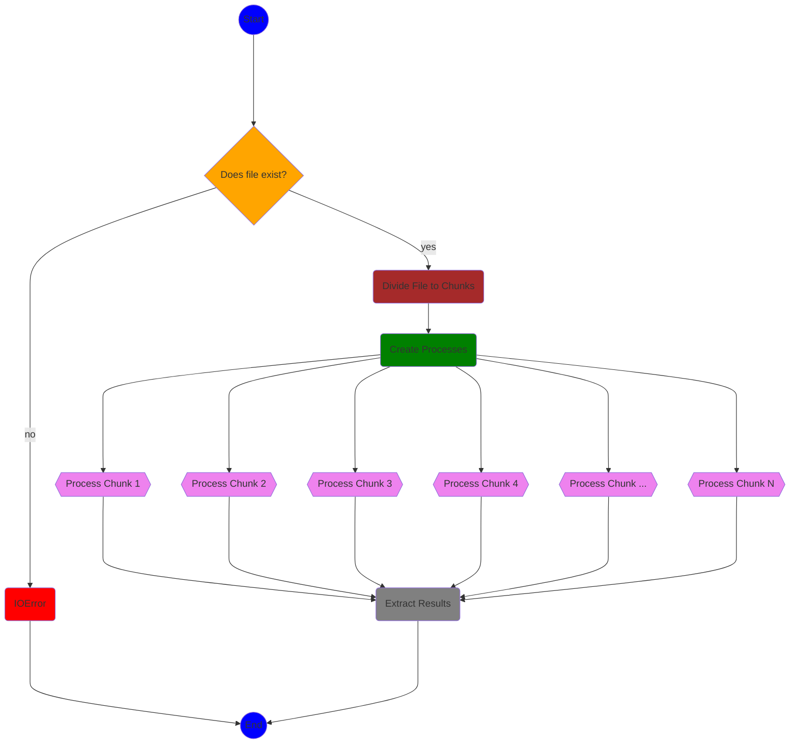

# Process large csv file with Multiprocessing module

#### This program splits a large data file to chunks and does a parallel computations for each chunk.
#### The file contains some data about trips by NY taxy companies. We need to calculate a total revenue of each company

